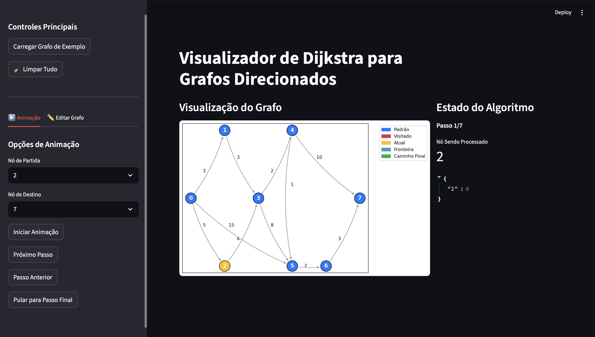
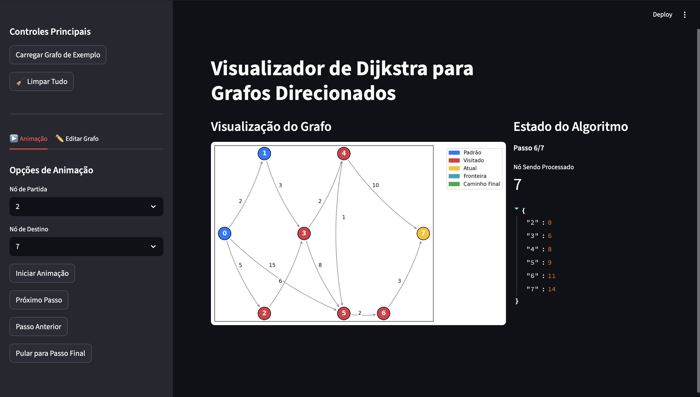
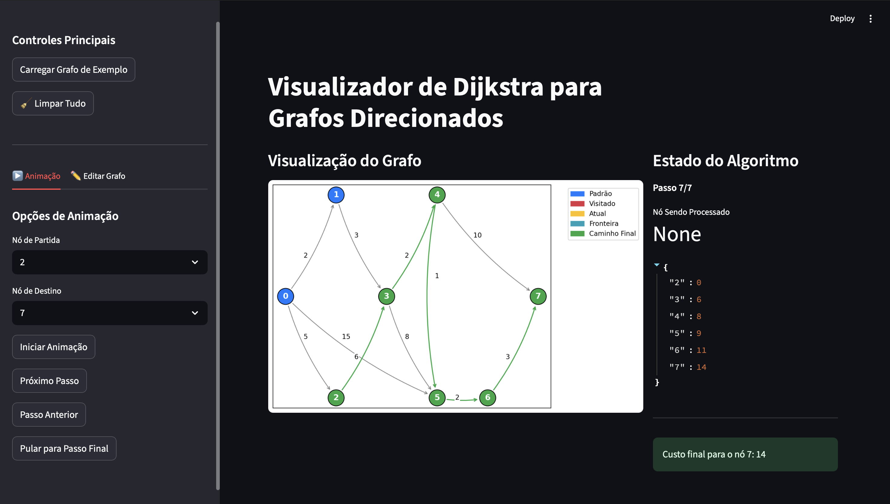
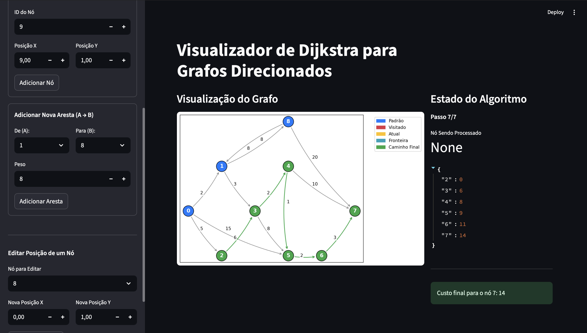

# Grafos2_dijkstra_visualizer

**Número da Lista**: 2
**Conteúdo da Disciplina**: FGA0124 - PROJETO DE ALGORITMOS - T01  


## Alunos


<div align = "center">
<table>
  <tr>
    <td align="center"><a href="https://github.com/DanielFsR"><br /><sub><b>Daniel Ferreira</b></sub></a><br /><a href="Link git" title="Rocketseat"></a></td>
    <td align="center"><a href="https://github.com/Diogo-Barboza"><br /><sub><b>Diogo Barboza </b></sub></a><br />
  </tr>
</table>

| Matrícula   | Aluno                             |
| ----------- | ----------------------------------|
| 22/2006632  | Daniel Ferreira                   |
| 22/2006660  | Diogo Rodrigues Barboza           |
</div>

## Sobre 
O sistema foi desenvolvido para ensinar, de forma interativa e visual, o funcionamento do algoritmo de Dijkstra. Ele oferece uma interface gráfica com um grafo inicial pré-configurado, permitindo ao usuário adicionar, remover ou modificar nós e arestas conforme desejar. Dessa forma, é possível explorar diferentes cenários e compreender passo a passo como o algoritmo encontra o caminho mais curto entre os vértices, tornando o aprendizado mais dinâmico e acessível.

## Screenshots









## Instalação e Ferramentas
- **Python 3.13**
- **Streamlit** (interface gráfica)
- **Heapq** (Criação da Heap)
- **Matplotlib** (visualização do grafo)


## Como compilar e executar o projeto

1. Clone este repositório  
2. Crie um ambiente virtual:
   ```bash
   python3 -m .venv venv
   source venv/bin/activate

3. Instale as dependências
    ```bash
    pip install -r requirements.txt

4. Execute o projeto:
    ```bash
    streamlit run app.py


## Uso 

Pode ser facilmente usado para ensinar de forma didática a execução em tempo real do algortimo de Dijkstra.

## Apresentação 

<div align="center">
<a href="https://youtu.be/4P9XdXVWwNk"></a>
</div>

<font size="3"><p style="text-align: center">Autor: [Diogo Barboza](https://github.com/) e [Daniel Ferreira](https://github.com/).</p></font>

